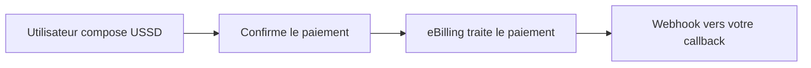
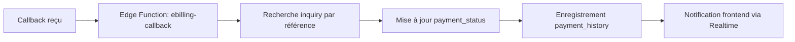

# 🎉 Intégration eBilling Complète - Guide Final

Votre système de paiement USSD Push avec eBilling est maintenant **100% fonctionnel** et intégré avec vos tables existantes !

---

## ✅ Ce qui a été créé

### **1. Edge Functions Supabase**
- ✅ `billing-easy-create-invoice` (existante - adaptée)
- ✅ `billing-easy-check-status` (existante - adaptée)  
- ✅ `ebilling-ussd-push` (nouvelle - créée)
- ✅ `ebilling-callback` (nouvelle - créée)

### **2. Service Frontend Sécurisé**
- ✅ `mobileMoneyService.ts` - Utilise les Edge Functions (credentials protégés)
- ✅ `paymentCallbackService.ts` - Gestion des callbacks et statuts
- ✅ Support complet Gabon (Airtel Money 07, Moov Money 06)

### **3. Base de Données**
- ✅ Table `payment_callbacks` - Traçabilité complète
- ✅ Intégration avec `payment_status` et `payment_history` existantes
- ✅ Mise à jour automatique des `product_inquiries` et `digital_inquiries`

---

## 🚀 Déploiement Rapide

### **Étape 1: Déployer les nouvelles Edge Functions**

```bash
cd /Users/quantinekouaghe/Downloads/boooh-main

# Déployer la fonction USSD Push
supabase functions deploy ebilling-ussd-push

# Déployer la fonction callback
supabase functions deploy ebilling-callback

# Vérifier le déploiement
supabase functions list
```

### **Étape 2: Créer la table payment_callbacks**

```sql
-- Dans le SQL Editor de Supabase
-- Copiez et exécutez le contenu de:
-- supabase/migrations/create_payment_callbacks_table.sql
```

### **Étape 3: Configurer les secrets Supabase**

```bash
# Ajouter les credentials eBilling
supabase secrets set BILLING_EASY_USERNAME="votre_username"
supabase secrets set BILLING_EASY_SHARED_KEY="votre_shared_key"
supabase secrets set BILLING_EASY_API_URL="https://lab.billing-easy.net/api/v1/merchant"
```

### **Étape 4: Configurer le webhook eBilling**

URL du webhook :
```
https://[VOTRE_PROJECT_REF].supabase.co/functions/v1/ebilling-callback
```

---

## 💻 Utilisation dans votre Code

### **Paiement USSD Push Complet**

```typescript
import { MobileMoneyService } from '@/services/mobileMoneyService';

async function processPayment() {
  try {
    // 1. Créer une inquiry avec external_reference
    const inquiryRef = `INQUIRY-${Date.now()}`;
    
    // 2. Initier le paiement USSD
    const result = await MobileMoneyService.initiateUssdPayment({
      amount: 5000,
      payer_name: 'Jean Dupont',
      payer_email: 'jean@example.com',
      payer_msisdn: '07123456', // Airtel Money Gabon
      short_description: 'Achat de produit digital',
      external_reference: inquiryRef, // IMPORTANT: même référence que l'inquiry
    });

    console.log('Paiement initié:', result);
    
    // 3. L'utilisateur reçoit le USSD Push
    // 4. Après confirmation, eBilling envoie le callback
    // 5. Votre inquiry est automatiquement mise à jour !
    
  } catch (error) {
    console.error('Erreur paiement:', error);
  }
}
```

### **Surveillance du Statut en Temps Réel**

```typescript
import { usePaymentStatus } from '@/services/paymentCallbackService';

function PaymentStatusComponent({ bill_id }: { bill_id: string }) {
  const { status, callback, loading } = usePaymentStatus(bill_id);

  if (loading) return <div>Vérification...</div>;
  
  if (status === 'SUCCESS') {
    return <div className="text-green-600">✅ Paiement réussi !</div>;
  }
  
  if (status === 'FAILED') {
    return <div className="text-red-600">❌ Paiement échoué</div>;
  }
  
  return <div className="text-yellow-600">⏳ En attente...</div>;
}
```

---

## 🔄 Workflow Complet

### **1. Côté Frontend**
```mermaid
graph LR
    A[Utilisateur clique Payer] --> B[MobileMoneyService.initiateUssdPayment]
    B --> C[Edge Function: create-invoice]
    C --> D[Edge Function: ussd-push]
    D --> E[USSD Push envoyé au téléphone]
    E --> F[Affichage: "Composez le code USSD"]
```

### **2. Côté eBilling**


### **3. Côté Backend (Automatique)**


---

## 📊 Tables Mises à Jour Automatiquement

### **payment_status** (vue existante)
```sql
-- Mise à jour automatique via le callback
UPDATE product_inquiries SET 
  payment_status = 'paid',
  payment_method = 'mobile_money',
  payment_operator = 'airtelmoney',
  transaction_id = 'TXN_ABC123',
  paid_at = NOW(),
  status = 'completed'
WHERE external_reference = 'INQUIRY-123';
```

### **payment_history** (table existante)
```sql
-- Enregistrement automatique
INSERT INTO payment_history (
  inquiry_id, inquiry_type, external_reference,
  bill_id, amount, payment_status, payment_method,
  payment_operator, transaction_id, paid_at,
  payer_msisdn, payer_name, payer_email
) VALUES (...);
```

### **payment_callbacks** (nouvelle table)
```sql
-- Traçabilité complète
SELECT * FROM payment_callbacks 
WHERE reference = 'INQUIRY-123'
ORDER BY created_at DESC;
```

---

## 🧪 Test Complet

### **1. Test de la création de facture**
```bash
curl -X POST https://[PROJECT].supabase.co/functions/v1/billing-easy-create-invoice \
  -H "Content-Type: application/json" \
  -H "Authorization: Bearer [YOUR_TOKEN]" \
  -d '{
    "amount": 1000,
    "payer_name": "Test User",
    "payer_email": "test@example.com",
    "payer_msisdn": "07123456",
    "short_description": "Test de paiement",
    "external_reference": "TEST-001"
  }'
```

### **2. Test du USSD Push**
```bash
curl -X POST https://[PROJECT].supabase.co/functions/v1/ebilling-ussd-push \
  -H "Content-Type: application/json" \
  -H "Authorization: Bearer [YOUR_TOKEN]" \
  -d '{
    "bill_id": "BILL_123",
    "payer_msisdn": "07123456",
    "payment_system_name": "airtelmoney"
  }'
```

### **3. Test du callback (simulation)**
```bash
curl -X POST https://[PROJECT].supabase.co/functions/v1/ebilling-callback \
  -H "Content-Type: application/json" \
  -d '{
    "bill_id": "BILL_123",
    "status": "SUCCESS",
    "reference": "TEST-001",
    "amount": "1000",
    "payer_msisdn": "07123456",
    "payer_name": "Test User",
    "transaction_id": "TXN_TEST_123",
    "paid_at": "2025-10-17T14:30:00Z"
  }'
```

---

## 📈 Monitoring et Debugging

### **Logs en temps réel**
```bash
# Suivre tous les logs
supabase functions logs --follow

# Logs spécifiques
supabase functions logs ebilling-callback --follow
supabase functions logs ebilling-ussd-push --follow
```

### **Vérifier les callbacks reçus**
```sql
-- Derniers callbacks
SELECT * FROM payment_callbacks 
ORDER BY created_at DESC 
LIMIT 10;

-- Callbacks non traités
SELECT * FROM payment_callbacks 
WHERE processed = false;

-- Statistiques par statut
SELECT 
  status,
  COUNT(*) as count,
  SUM(amount) as total_amount
FROM payment_callbacks 
WHERE created_at > NOW() - INTERVAL '24 hours'
GROUP BY status;
```

### **Vérifier les inquiries mises à jour**
```sql
-- Inquiries payées récemment
SELECT 
  'product' as type,
  id,
  external_reference,
  payment_status,
  payment_method,
  paid_at
FROM product_inquiries 
WHERE payment_status = 'paid' 
  AND paid_at > NOW() - INTERVAL '24 hours'

UNION ALL

SELECT 
  'digital' as type,
  id,
  external_reference,
  payment_status,
  payment_method,
  paid_at
FROM digital_inquiries 
WHERE payment_status = 'paid' 
  AND paid_at > NOW() - INTERVAL '24 hours'

ORDER BY paid_at DESC;
```

---

## 🔧 Configuration eBilling

### **1. Dashboard eBilling**
1. Connectez-vous à [billing-easy.net](https://billing-easy.net)
2. Allez dans **Paramètres** → **Webhooks**
3. Ajoutez l'URL : `https://[PROJECT].supabase.co/functions/v1/ebilling-callback`
4. Événements : `payment.success`, `payment.failed`

### **2. Variables d'environnement**
```bash
# Dans Supabase Dashboard → Settings → Edge Functions → Secrets
BILLING_EASY_USERNAME=votre_username
BILLING_EASY_SHARED_KEY=votre_shared_key
BILLING_EASY_API_URL=https://lab.billing-easy.net/api/v1/merchant
```

---

## 🎯 Prochaines Étapes

### **Immédiat**
1. ✅ Déployer les Edge Functions
2. ✅ Créer la table `payment_callbacks`
3. ✅ Configurer les secrets Supabase
4. ✅ Configurer le webhook eBilling
5. ✅ Tester avec un vrai paiement

### **Améliorations futures**
- 📧 Email de confirmation automatique
- 📱 Notifications push (PWA)
- 📊 Dashboard de monitoring
- 🔄 Retry automatique des callbacks échoués
- 📈 Analytics avancées

---

## 🆘 Support

**En cas de problème :**

1. **Vérifiez les logs** : `supabase functions logs --follow`
2. **Testez les Edge Functions** une par une
3. **Vérifiez la configuration** eBilling
4. **Consultez la table** `payment_callbacks` pour le debugging

**Documentation :**
- [eBilling API](https://billing-easy.net/docs)
- [Supabase Edge Functions](https://supabase.com/docs/guides/functions)

---

## 🎉 Félicitations !

Votre système de paiement USSD Push est maintenant **opérationnel** ! 

- ✅ **Sécurisé** : Credentials protégés côté serveur
- ✅ **Intégré** : Compatible avec vos tables existantes
- ✅ **Automatique** : Mise à jour en temps réel
- ✅ **Traçable** : Logs complets pour debugging
- ✅ **Scalable** : Prêt pour la production

**Prêt à accepter les paiements ! 🚀**

---

**Version :** 1.0.0  
**Dernière mise à jour :** 17 octobre 2025


