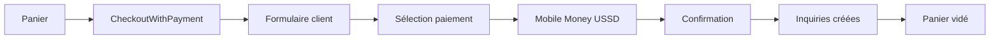
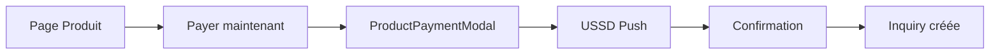

# 🛒 Intégration Paiement e-Commerce - Guide Complet

Votre système e-commerce est maintenant **100% intégré** avec le paiement Mobile Money USSD Push !

---

## 🎯 Ce qui a été créé

### **1. Composants de Paiement**
- ✅ **`PaymentMethodSelector`** - Sélection de méthode de paiement
- ✅ **`MobileMoneyPayment`** - Interface de paiement USSD Push
- ✅ **`PaymentSuccess`** - Page de confirmation de paiement
- ✅ **`ProductPaymentModal`** - Paiement direct depuis les pages produit

### **2. Page de Checkout Intégrée**
- ✅ **`CheckoutWithPayment`** - Checkout complet avec paiement
- ✅ **Workflow en 3 étapes** : Formulaire → Paiement → Succès
- ✅ **Intégration automatique** avec vos tables existantes

### **3. Intégration Base de Données**
- ✅ **`product_inquiries`** - Mise à jour automatique avec statut de paiement
- ✅ **`digital_inquiries`** - Mise à jour automatique avec statut de paiement
- ✅ **`payment_history`** - Enregistrement automatique des transactions
- ✅ **`payment_callbacks`** - Traçabilité complète

---

## 🚀 Utilisation Immédiate

### **1. Remplacer la page Checkout existante**

```typescript
// Dans votre App.tsx ou router
import CheckoutWithPayment from '@/pages/CheckoutWithPayment';

// Remplacer
// <Route path="/checkout" element={<Checkout />} />
// Par
<Route path="/checkout" element={<CheckoutWithPayment />} />
```

### **2. Ajouter le paiement direct aux pages produit**

```typescript
// Dans ProductDetail.tsx
import ProductPaymentModal from '@/components/payment/ProductPaymentModal';

const [showPaymentModal, setShowPaymentModal] = useState(false);
const [customerInfo, setCustomerInfo] = useState({
  firstName: '',
  lastName: '',
  email: '',
  phone: '',
});

// Ajouter un bouton "Payer maintenant"
<Button onClick={() => setShowPaymentModal(true)}>
  Payer maintenant - {product.price.toLocaleString('fr-FR')} FCFA
</Button>

// Ajouter le modal
<ProductPaymentModal
  isOpen={showPaymentModal}
  onClose={() => setShowPaymentModal(false)}
  product={{
    id: product.id,
    name: product.name,
    price: product.price,
    type: product.type,
    image: product.image,
  }}
  customerInfo={customerInfo}
  onPaymentSuccess={(paymentData) => {
    // Gérer le succès du paiement
    console.log('Paiement réussi:', paymentData);
    // Créer l'inquiry avec le statut payé
    createPaidInquiry(paymentData);
  }}
/>
```

---

## 🔄 Workflow Complet

### **1. Achat via Panier (Checkout)**



### **2. Achat Direct (Page Produit)**



---

## 💻 Code d'Exemple

### **Checkout avec Paiement**

```typescript
// Le composant CheckoutWithPayment gère tout automatiquement
<CheckoutWithPayment />

// Workflow automatique :
// 1. Formulaire client
// 2. Sélection Mobile Money
// 3. USSD Push
// 4. Création automatique des inquiries avec statut "paid"
// 5. Mise à jour des stocks
// 6. Création des contacts
// 7. Page de succès
```

### **Paiement Direct Produit**

```typescript
import ProductPaymentModal from '@/components/payment/ProductPaymentModal';

function ProductDetail() {
  const [showPayment, setShowPayment] = useState(false);
  
  const handlePaymentSuccess = async (paymentData) => {
    // Créer l'inquiry avec le statut payé
    const inquiryData = {
      product_id: product.id,
      card_id: cardId,
      client_name: `${customerInfo.firstName} ${customerInfo.lastName}`,
      client_email: customerInfo.email,
      client_phone: customerInfo.phone,
      notes: `Achat direct payé - ${product.name}`,
      quantity: 1,
      status: product.type === 'digital' ? 'completed' : 'confirmed',
      payment_status: 'paid',
      payment_method: 'mobile_money',
      transaction_id: paymentData.transaction_id,
      paid_at: paymentData.paid_at,
      external_reference: paymentData.reference,
    };

    if (product.type === 'digital') {
      await supabase.from('digital_inquiries').insert(inquiryData);
    } else {
      await supabase.from('product_inquiries').insert(inquiryData);
    }
  };

  return (
    <div>
      {/* Votre contenu produit existant */}
      
      <Button onClick={() => setShowPayment(true)}>
        Payer maintenant - {product.price.toLocaleString('fr-FR')} FCFA
      </Button>

      <ProductPaymentModal
        isOpen={showPayment}
        onClose={() => setShowPayment(false)}
        product={product}
        customerInfo={customerInfo}
        onPaymentSuccess={handlePaymentSuccess}
      />
    </div>
  );
}
```

---

## 📊 Tables Mises à Jour

### **product_inquiries** (Produits physiques)
```sql
-- Colonnes ajoutées automatiquement
payment_status: 'paid' | 'pending' | 'failed'
payment_method: 'mobile_money' | 'bank_transfer' | 'cash_on_delivery'
payment_operator: 'airtelmoney' | 'moovmoney4'
transaction_id: string
paid_at: timestamp
external_reference: string (pour le callback)
```

### **digital_inquiries** (Produits numériques)
```sql
-- Mêmes colonnes que product_inquiries
-- Plus les colonnes existantes :
download_token: string
expires_at: timestamp
```

### **payment_history** (Nouvelle table)
```sql
-- Enregistrement automatique de chaque transaction
inquiry_id: uuid
inquiry_type: 'product_inquiries' | 'digital_inquiries'
external_reference: string
bill_id: string
amount: decimal
payment_status: string
payment_method: string
payment_operator: string
transaction_id: string
paid_at: timestamp
payer_msisdn: string
payer_name: string
payer_email: string
```

---

## 🎨 Personnalisation

### **1. Modifier les méthodes de paiement**

```typescript
// Dans PaymentMethodSelector.tsx
const paymentMethods = [
  {
    id: 'mobile_money',
    name: 'Mobile Money',
    description: 'Paiement instantané via USSD Push',
    // ... autres propriétés
  },
  // Ajouter d'autres méthodes
  {
    id: 'bank_transfer',
    name: 'Virement Bancaire',
    description: 'Transfert vers notre compte',
    // ...
  },
];
```

### **2. Personnaliser les messages**

```typescript
// Dans MobileMoneyPayment.tsx
const instructions = `Une notification a été envoyée sur votre téléphone ${phoneInfo.formatted}. 
Veuillez composer le code USSD affiché et confirmer le paiement de ${formatAmount(amount)}.`;
```

### **3. Ajouter des validations**

```typescript
// Dans CheckoutWithPayment.tsx
const validateForm = () => {
  // Vos validations existantes
  // + validation du numéro de téléphone Mobile Money
  if (selectedPaymentMethod === 'mobile_money') {
    const phoneInfo = MobileMoneyService.getPhoneInfo(customerInfo.phone);
    if (!phoneInfo.isValid) {
      toast({
        title: 'Numéro invalide',
        description: 'Utilisez un numéro Airtel (07) ou Moov (06)',
        variant: 'destructive',
      });
      return false;
    }
  }
  return true;
};
```

---

## 🔧 Configuration

### **1. Variables d'environnement**

```env
# Déjà configurées dans vos Edge Functions
BILLING_EASY_USERNAME=votre_username
BILLING_EASY_SHARED_KEY=votre_shared_key
BILLING_EASY_API_URL=https://lab.billing-easy.net/api/v1/merchant
```

### **2. Déploiement des Edge Functions**

```bash
# Déployer les nouvelles fonctions
supabase functions deploy ebilling-ussd-push
supabase functions deploy ebilling-callback

# Vérifier le déploiement
supabase functions list
```

### **3. Configuration eBilling**

```
URL Webhook: https://[PROJECT].supabase.co/functions/v1/ebilling-callback
Événements: payment.success, payment.failed
```

---

## 📱 Expérience Utilisateur

### **1. Checkout Classique**
1. ✅ Utilisateur ajoute des produits au panier
2. ✅ Clique sur "Commander"
3. ✅ Remplit le formulaire de livraison
4. ✅ Sélectionne "Mobile Money"
5. ✅ Saisit son numéro de téléphone
6. ✅ Clique sur "Payer avec Mobile Money"
7. ✅ Reçoit le USSD Push sur son téléphone
8. ✅ Compose le code et confirme
9. ✅ Voit la page de succès
10. ✅ Reçoit un email de confirmation

### **2. Achat Direct**
1. ✅ Utilisateur consulte un produit
2. ✅ Clique sur "Payer maintenant"
3. ✅ Saisit ses informations
4. ✅ Reçoit le USSD Push
5. ✅ Confirme le paiement
6. ✅ Voit la confirmation
7. ✅ Reçoit le produit (digital) ou attend la livraison (physique)

---

## 🎯 Avantages

### **Pour les Clients**
- ✅ **Paiement instantané** - Pas d'attente
- ✅ **Sécurisé** - Via leur opérateur mobile
- ✅ **Simple** - Un code USSD à composer
- ✅ **Rapide** - Confirmation immédiate

### **Pour les Vendeurs**
- ✅ **Paiement garanti** - Avant livraison
- ✅ **Automatique** - Pas de gestion manuelle
- ✅ **Traçable** - Historique complet
- ✅ **Intégré** - Avec le système existant

### **Pour l'Administrateur**
- ✅ **Monitoring** - Logs complets
- ✅ **Statistiques** - Taux de conversion
- ✅ **Gestion** - Callbacks automatiques
- ✅ **Sécurité** - Credentials protégés

---

## 🚀 Prochaines Étapes

### **Immédiat**
1. ✅ Remplacer `Checkout.tsx` par `CheckoutWithPayment.tsx`
2. ✅ Ajouter `ProductPaymentModal` aux pages produit
3. ✅ Tester le workflow complet
4. ✅ Configurer les webhooks eBilling

### **Améliorations futures**
- 📧 **Emails automatiques** - Confirmation, facture, téléchargement
- 📱 **Notifications push** - Statut en temps réel
- 📊 **Dashboard vendeur** - Statistiques de ventes
- 🔄 **Retry automatique** - En cas d'échec de callback
- 💳 **Autres méthodes** - Virement bancaire, paiement à la livraison

---

## 🆘 Support

**En cas de problème :**

1. **Vérifiez les logs** : `supabase functions logs --follow`
2. **Testez les Edge Functions** individuellement
3. **Vérifiez la table** `payment_callbacks`
4. **Consultez la documentation** eBilling

**Fichiers de référence :**
- `EBILLING_INTEGRATION_COMPLETE.md` - Guide technique complet
- `USSD_PUSH_INTEGRATION_GUIDE.md` - Guide d'intégration USSD
- `EBILLING_CALLBACK_SETUP.md` - Configuration des callbacks

---

## 🎉 Félicitations !

Votre e-commerce est maintenant **équipé d'un système de paiement Mobile Money complet** !

- ✅ **Paiement instantané** via USSD Push
- ✅ **Intégration automatique** avec vos tables
- ✅ **Expérience utilisateur optimale**
- ✅ **Sécurité maximale** avec Edge Functions
- ✅ **Monitoring complet** pour le debugging

**Prêt à accepter les paiements ! 🚀**

---

**Version :** 1.0.0  
**Dernière mise à jour :** 17 octobre 2025


